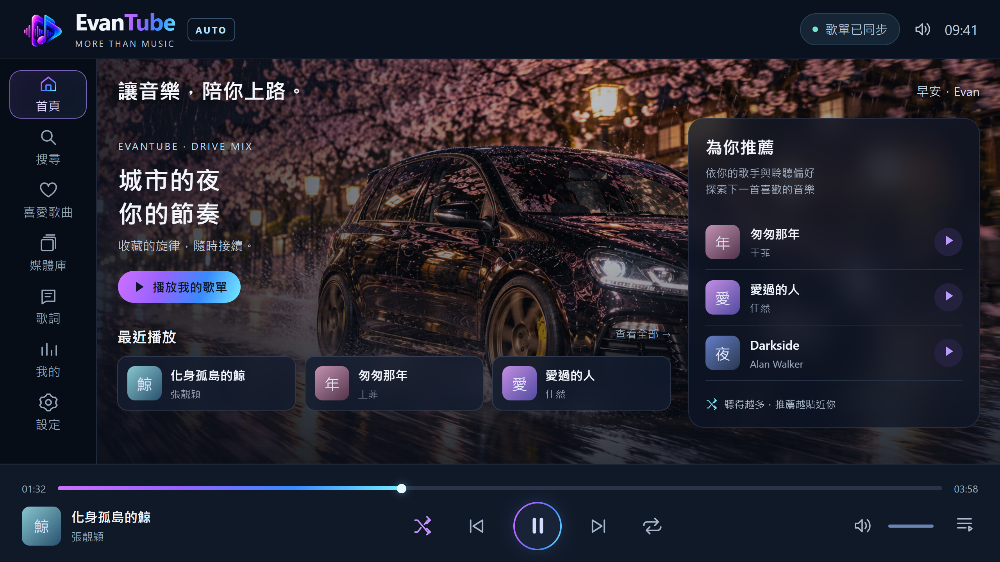
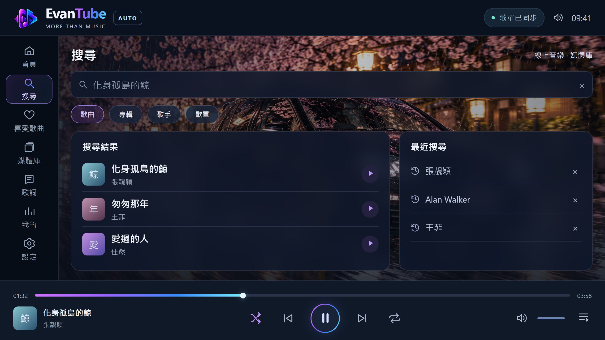
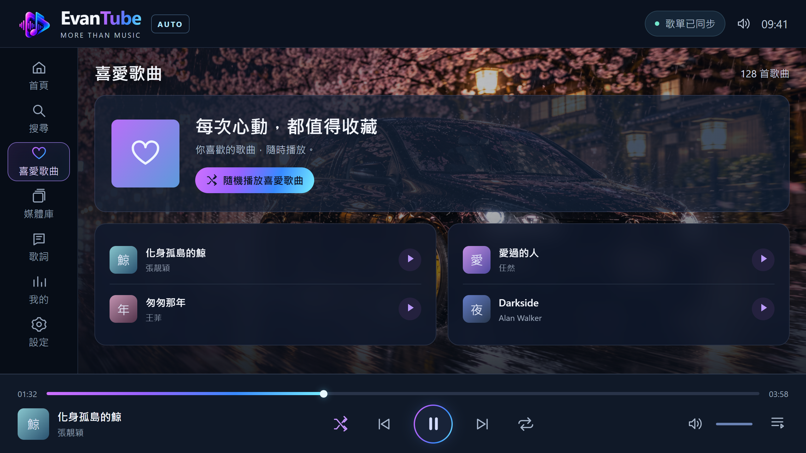
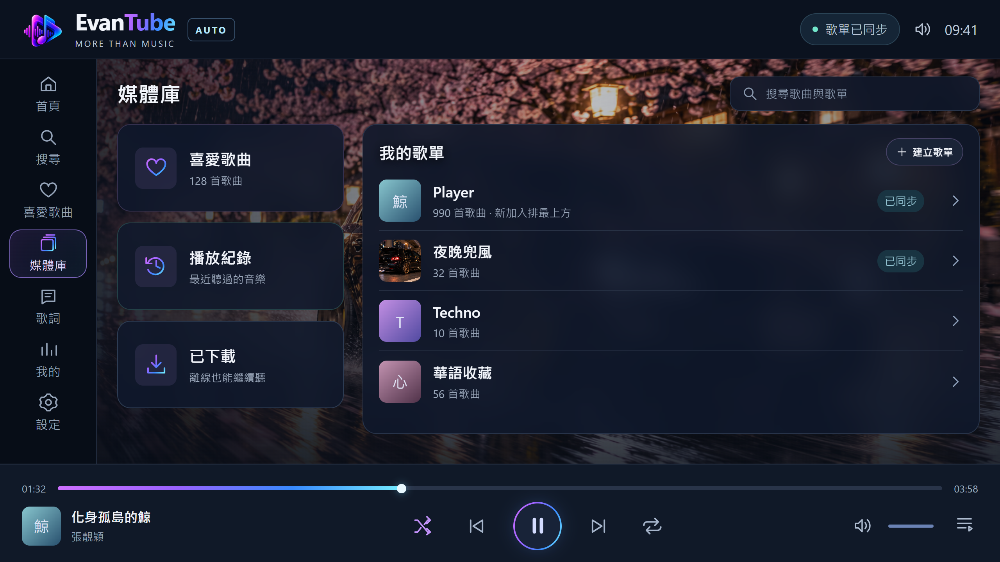
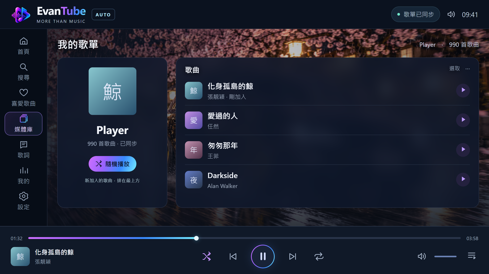
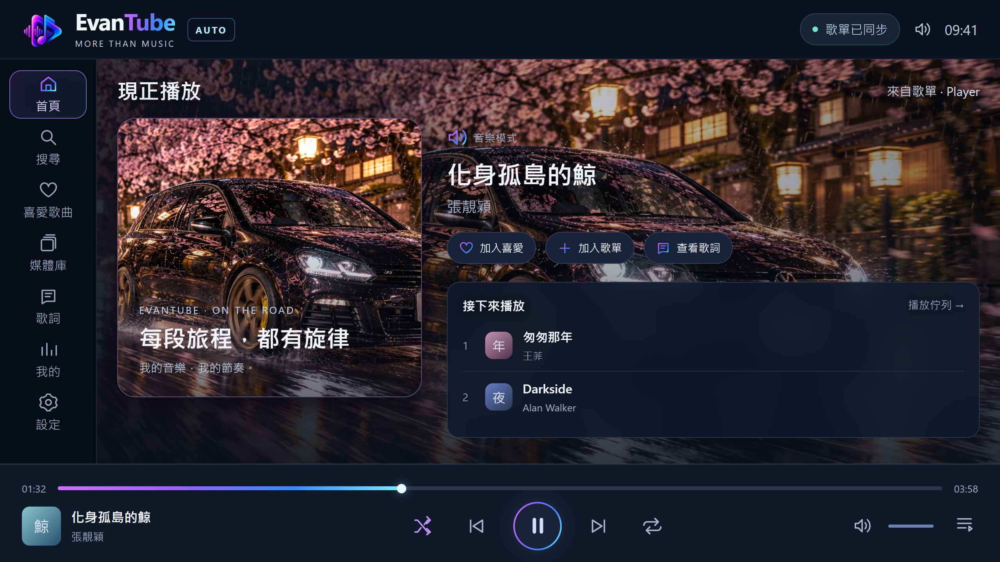
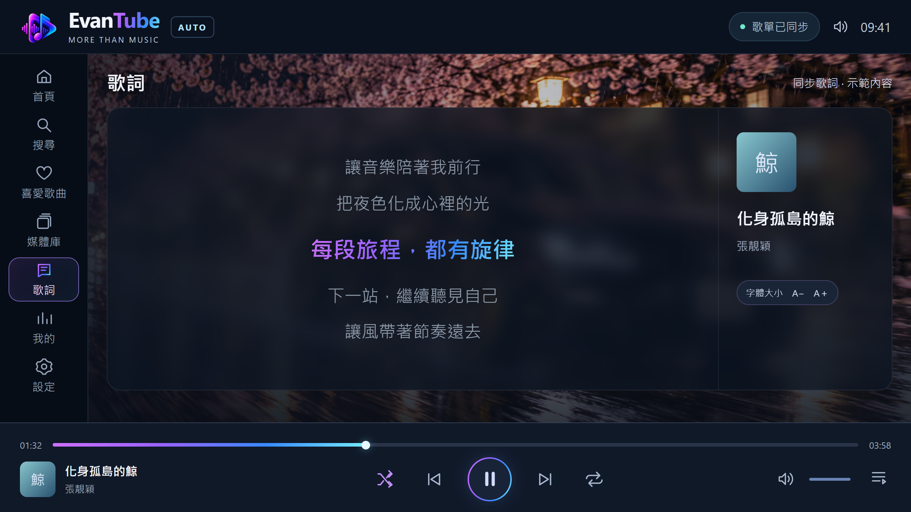
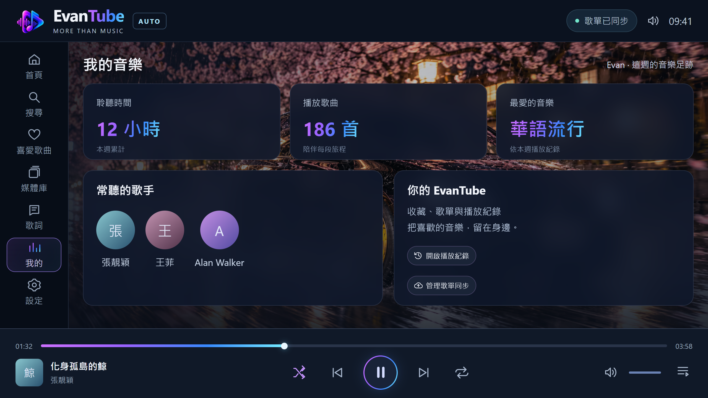
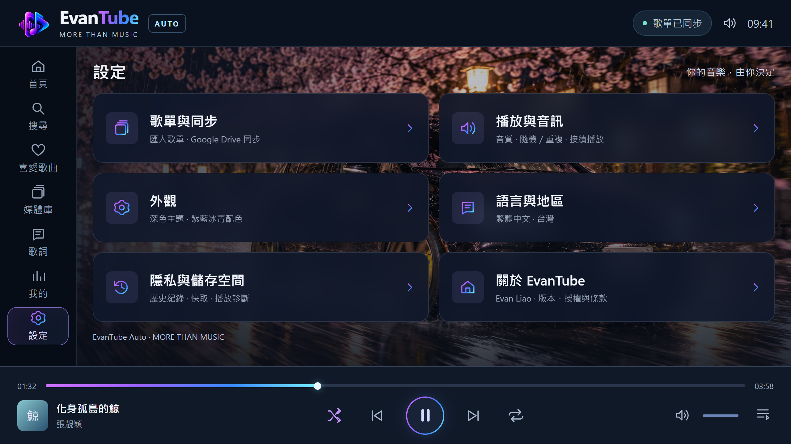
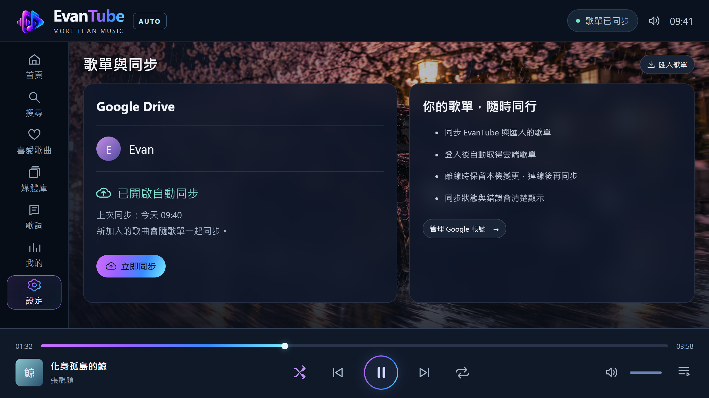

# EvanTube Auto 靜態設計預覽

背景圖片延展到右側內容區；左側導覽、頂部品牌及下方播放控制保持深色。
歌曲、封面、數量、歌詞與同步狀態為示範內容，並非實際 API 或裝置狀態。
這是供審核的圖片，尚未變更 Android 正式 APK。

點選圖片可在手機瀏覽器放大或儲存。

| 頁面 | PNG |
| --- | --- |
| 首頁 | [開啟圖片](home.png) |
| 搜尋 | [開啟圖片](search.png) |
| 喜愛歌曲 | [開啟圖片](favorites.png) |
| 媒體庫 | [開啟圖片](library.png) |
| 歌單內容 | [開啟圖片](playlist.png) |
| 現正播放 | [開啟圖片](playing.png) |
| 歌詞 | [開啟圖片](lyrics.png) |
| 我的音樂 | [開啟圖片](my.png) |
| 設定 | [開啟圖片](settings.png) |
| 歌單與同步 | [開啟圖片](sync.png) |

