# EvanTube 車機版 · 黑色與專輯封面設計預覽

左側導覽、頂部品牌與下方播放控制使用純黑底。現正播放的小圖與大圖改為專輯封面，封面本身維持完整顏色。

建議方案：右側內容區保留延展背景，卡片使用約 87% 不透明的黑色並稍微模糊，讓背景透出且文字清楚。另附純黑底方案供比較。

以下為靜態設計預覽；歌曲、數量、歌詞及同步狀態為示範內容。尚未套用到正式 Android APK。

點選圖片可在手機瀏覽器放大或儲存。

## 效果比較

半透明黑色卡片與背景：

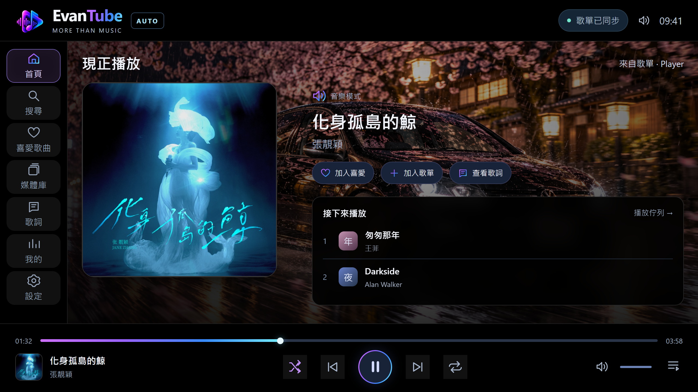

純黑底：

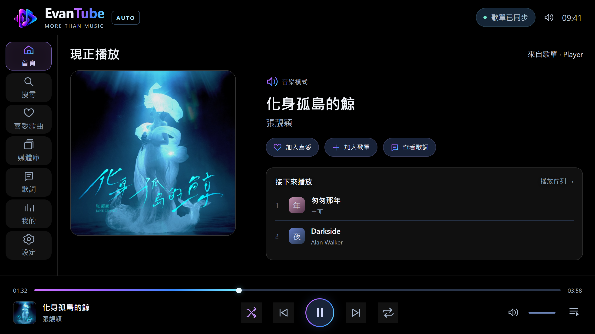

首頁純黑底：

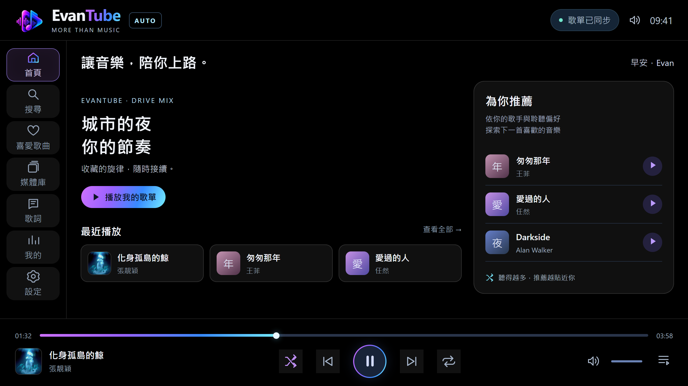

## 十頁預覽 · 半透明黑色方案

| 頁面 | PNG |
| --- | --- |
| 首頁 | [開啟圖片](home.png) |
| 搜尋 | [開啟圖片](search.png) |
| 喜愛歌曲 | [開啟圖片](favorites.png) |
| 媒體庫 | [開啟圖片](library.png) |
| 歌單內容 | [開啟圖片](playlist.png) |
| 現正播放 | [開啟圖片](playing.png) |
| 歌詞 | [開啟圖片](lyrics.png) |
| 我的音樂 | [開啟圖片](my.png) |
| 設定 | [開啟圖片](settings.png) |
| 歌單與同步 | [開啟圖片](sync.png) |

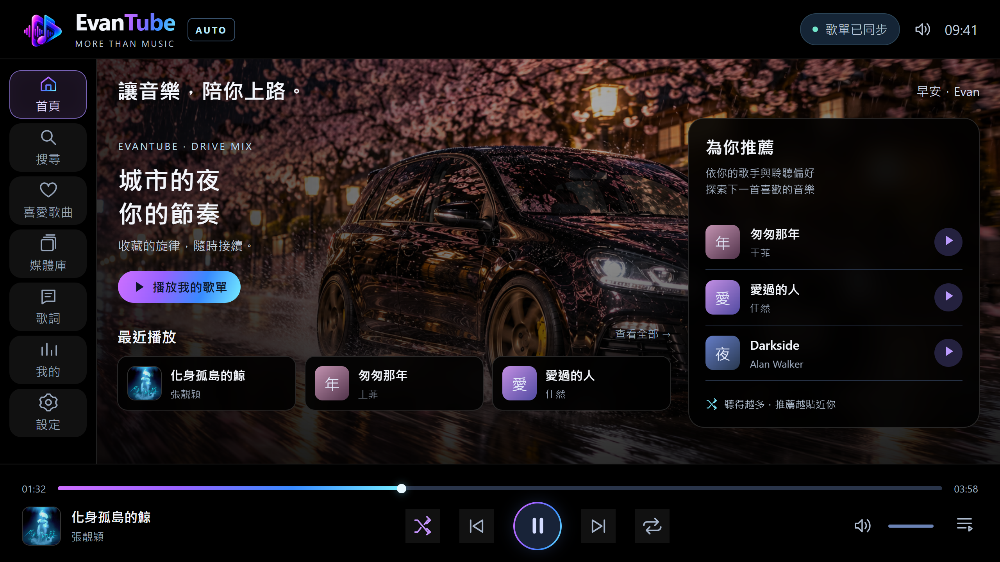

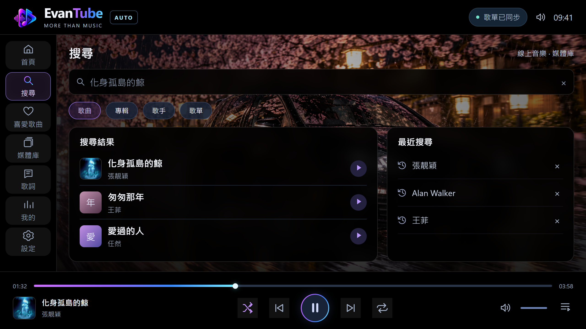

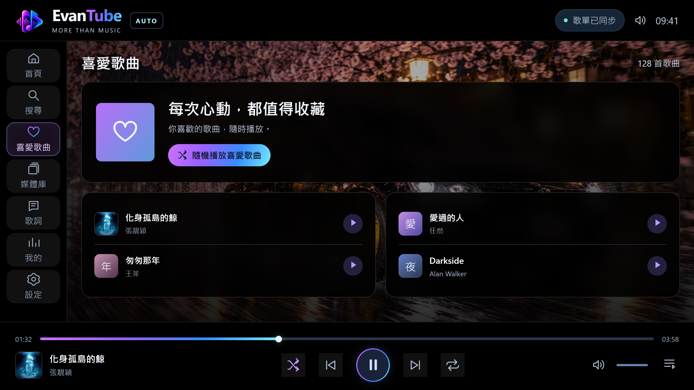

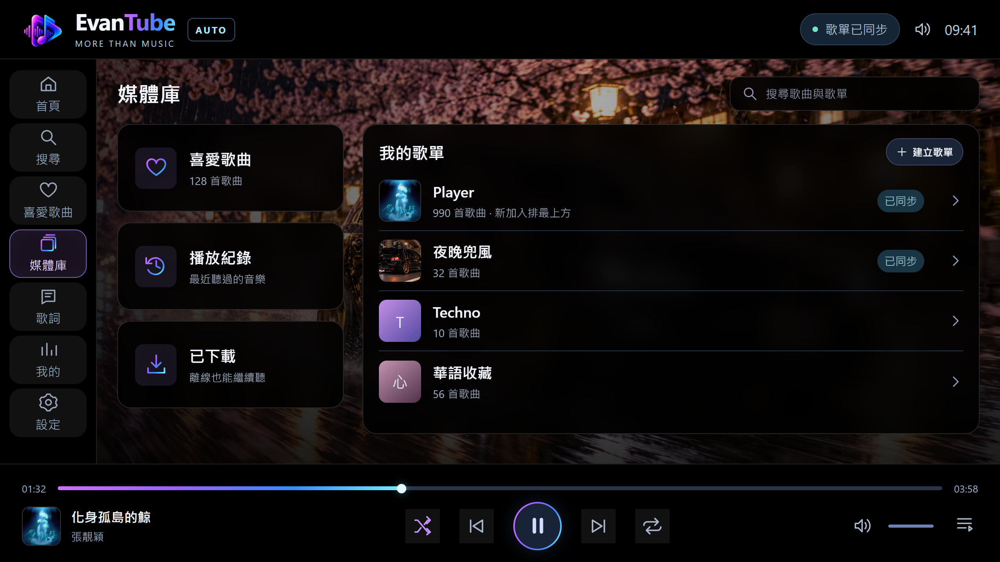

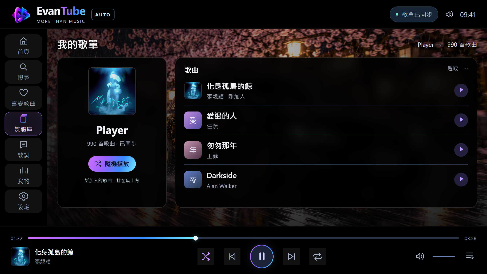

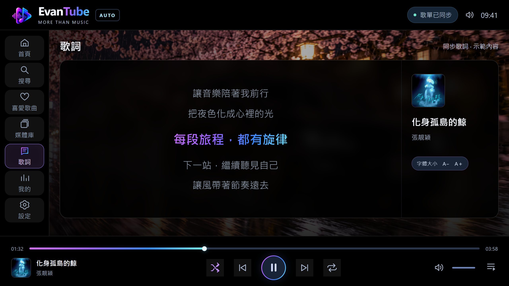

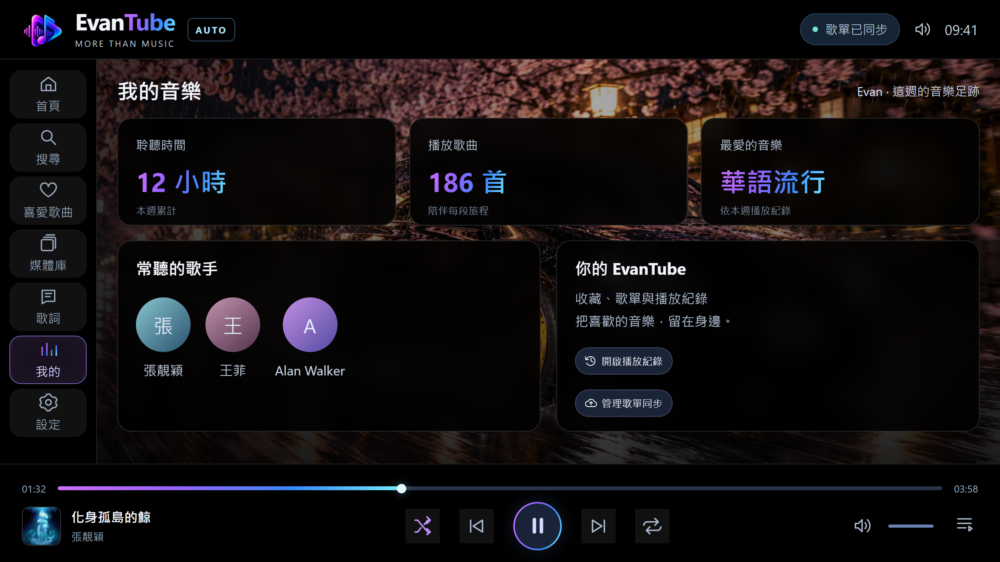

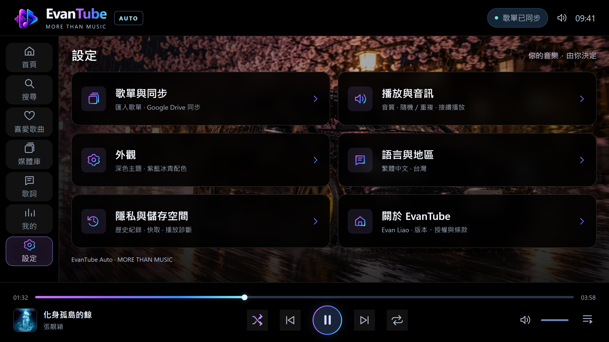

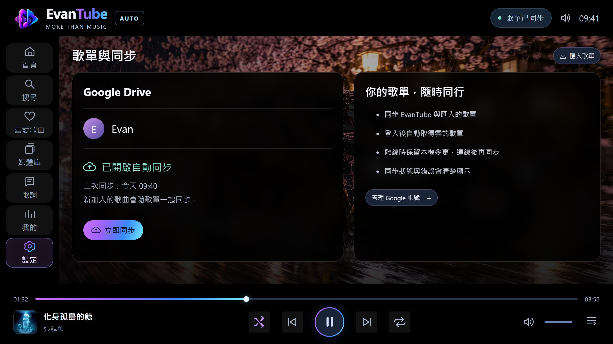

預覽中的張靚穎《化身孤島的鯨》封面來源：[Apple Music 專輯頁](https://music.apple.com/us/album/1787719836)。正式介面應依當前歌曲資料切換封面，其餘字母圖塊仍為設計用佔位內容。
