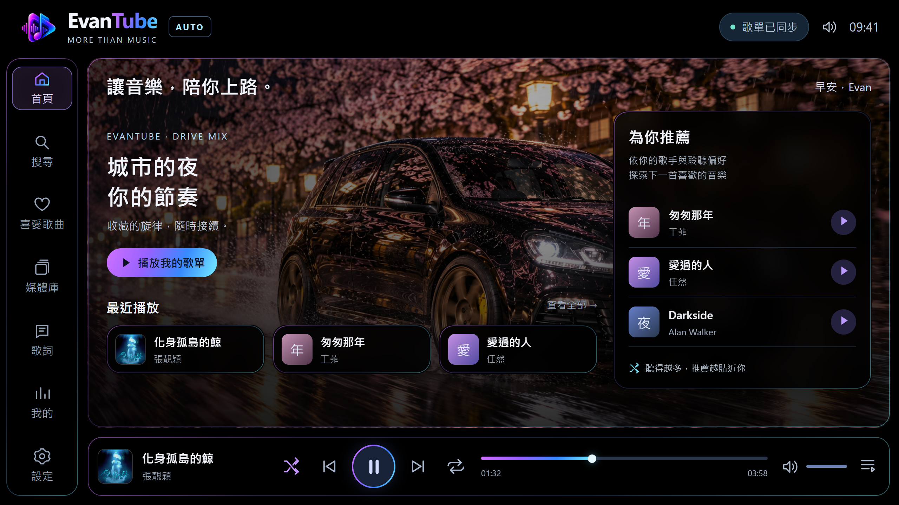
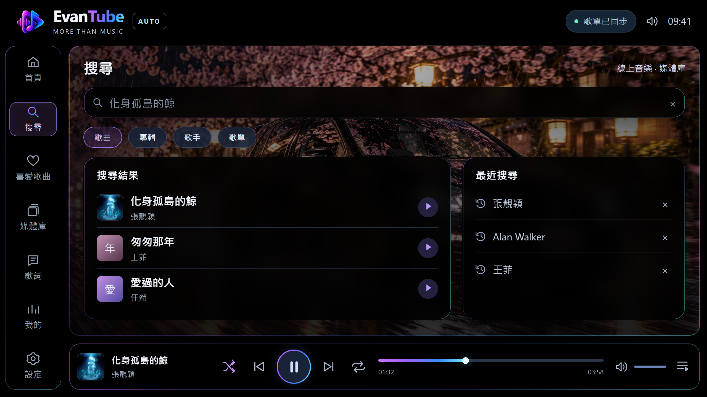
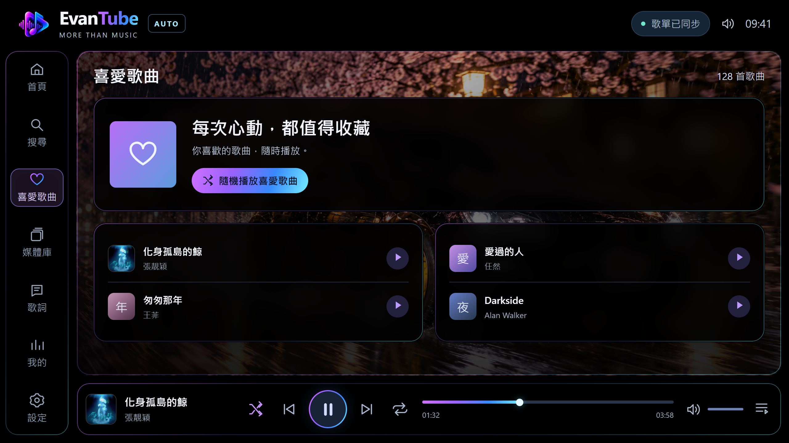
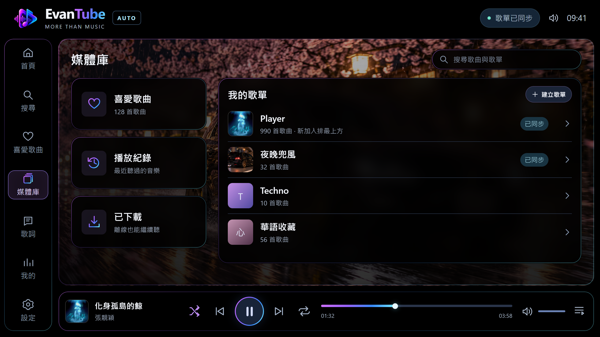
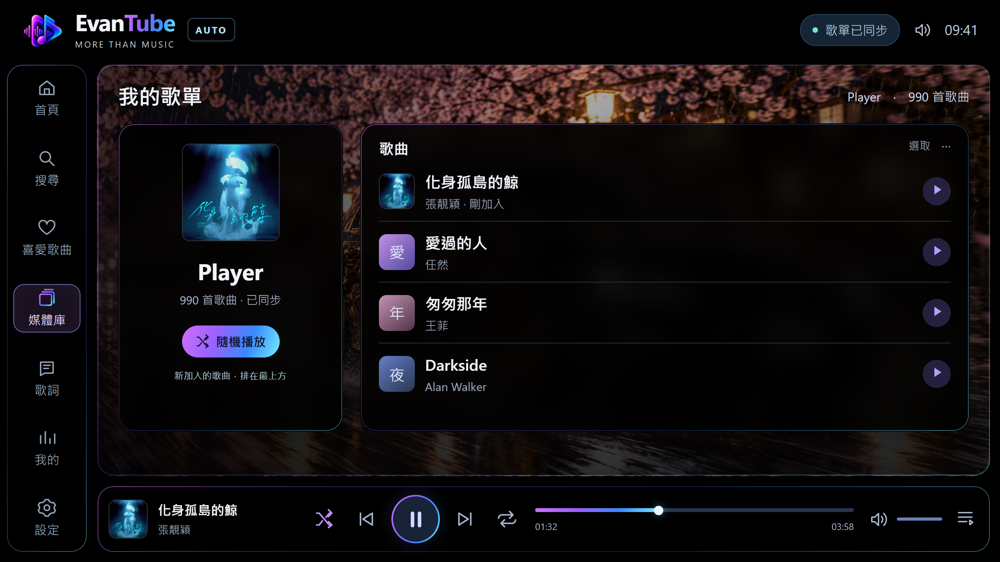
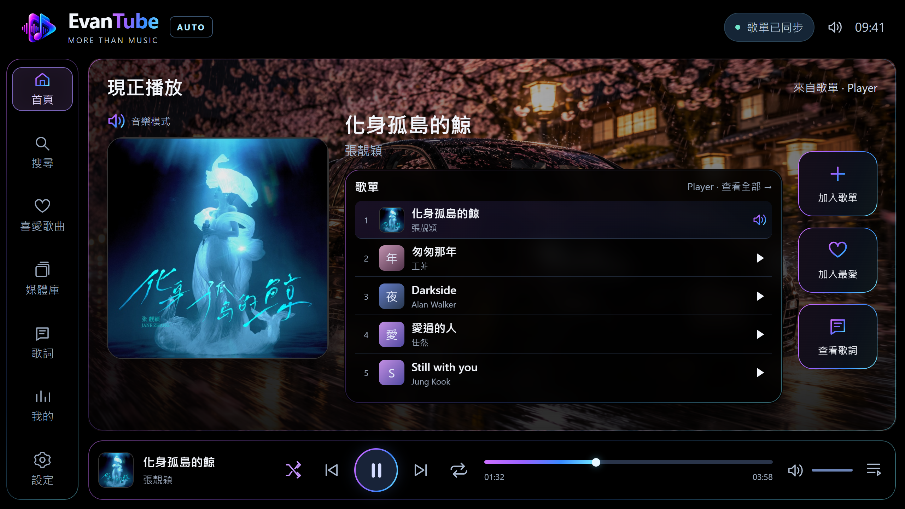
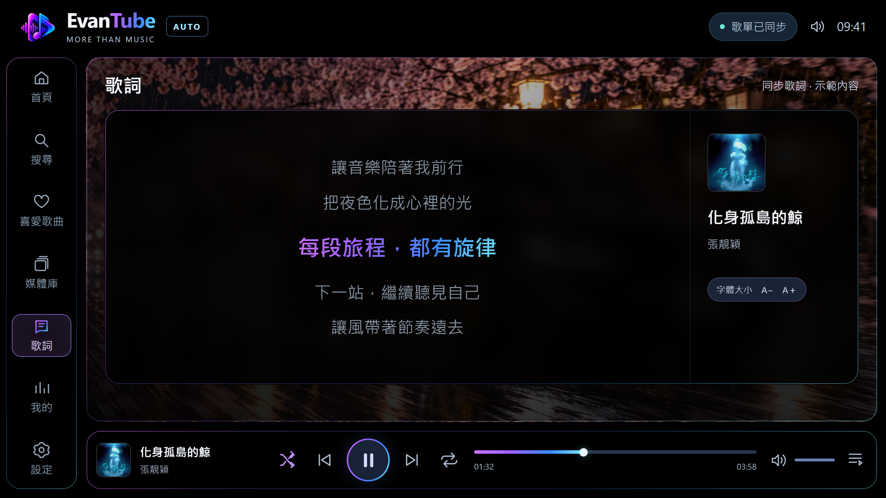
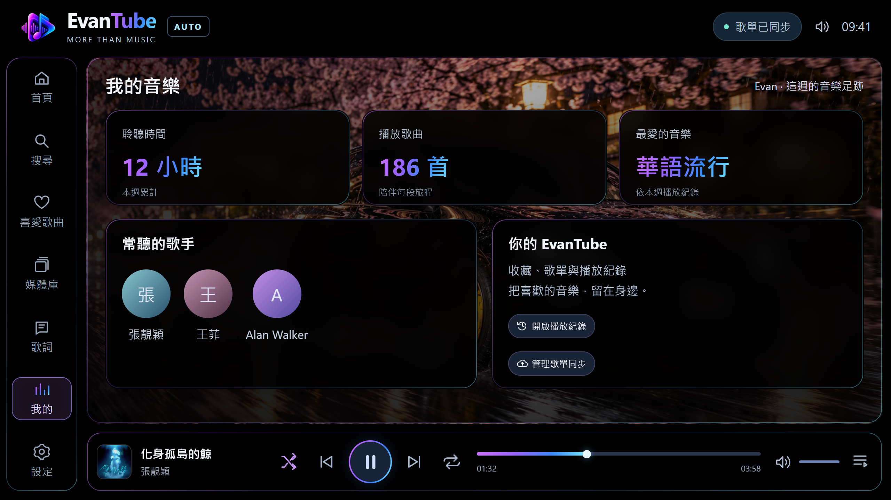
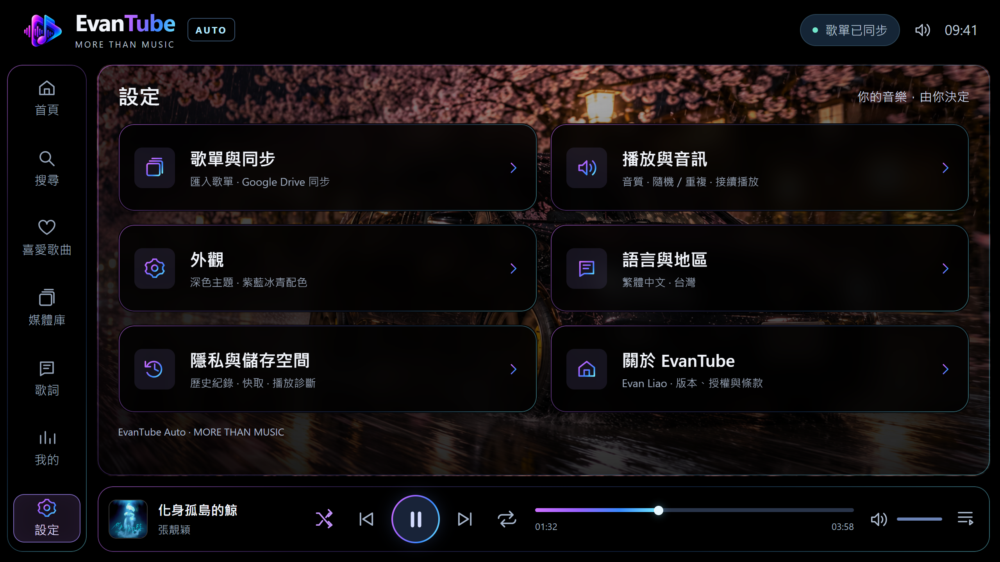
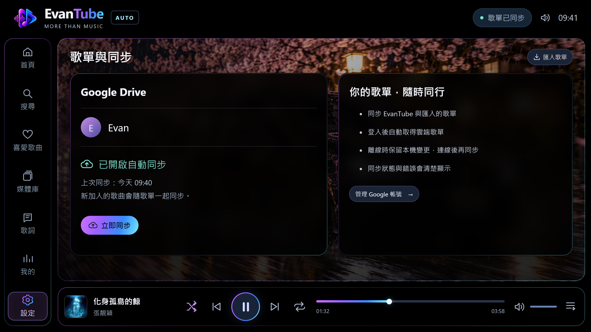

# EvanTube 車機版 · 半透明圓角外框

依照提供的參考圖調整：主內容、左側導覽、內容卡片與下方播放區使用圓角細框，搭配紫、藍、冰青漸層描邊。

下方播放區改為獨立圓角長條，專輯封面、歌曲資訊、播放控制、進度與音量排在同一列。左側導覽延伸到底部，播放區與右側主內容對齊並保留間隔。

主內容卡片保留約 87% 不透明的黑色與輕微背景模糊，背景圖延展範圍仍限於右側主內容。專輯封面保持原色。

現正播放頁的「接下來播放」改為「歌單」，框內完整顯示 5 首歌曲並標示當前歌曲。「加入歌單」、「加入最愛」與「查看歌詞」移至最右側直排。

這些是供審核的靜態預覽，尚未套用到正式 Android APK。歌曲、數量、歌詞與同步狀態為示範內容。

手機點選圖片即可放大或儲存。

| 頁面 | PNG |
| --- | --- |
| 首頁 | [開啟圖片](home.png) |
| 搜尋 | [開啟圖片](search.png) |
| 喜愛歌曲 | [開啟圖片](favorites.png) |
| 媒體庫 | [開啟圖片](library.png) |
| 歌單內容 | [開啟圖片](playlist.png) |
| 現正播放 | [開啟圖片](playing.png) |
| 歌詞 | [開啟圖片](lyrics.png) |
| 我的音樂 | [開啟圖片](my.png) |
| 設定 | [開啟圖片](settings.png) |
| 歌單與同步 | [開啟圖片](sync.png) |

專輯封面來源：[Apple Music · 張靚穎《化身孤島的鯨》](https://music.apple.com/us/album/1787719836)。其他字母圖塊仍為設計用佔位內容。
